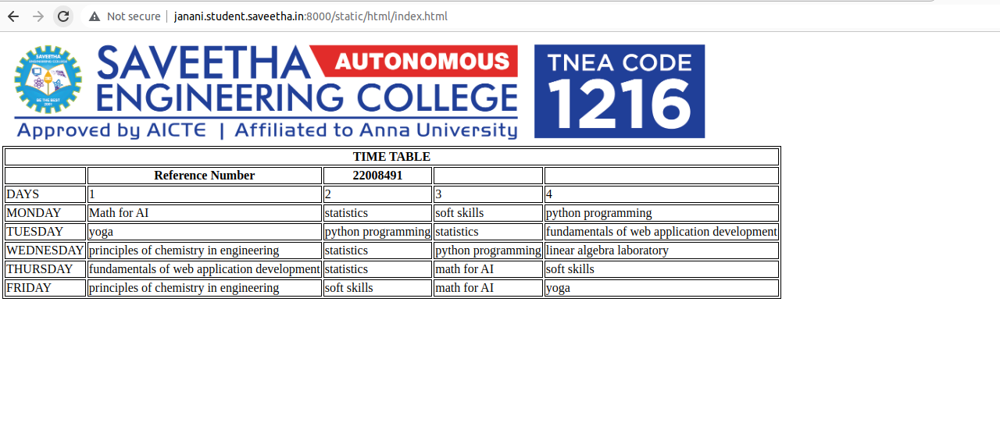

# Experiment_Time_Table

## AIM
To Write a html webpage page to display your timetable.

# ALGORITHM
### STEP 1
create a simple table using table tag
### STEP 2
Add header row using th tag
### STEP 3
Add your timetable
### STEP 4
Execute the program

# CODE
```
<!DOCTYPE html>
<html>
    <style>
        table,th,td{
            border:1px solid black;
        }
    </style>
    <body>
        
        <table>
            <tr>
                <th colspan="5" align="center"><b>TIME TABLE</b></th>
            </tr>
            <tr>
                <th> </th>
                <th><b>Reference Number</b></th>
                <th>22008491</th>
                <th></th>
                <th></th>
            </tr>
            
                <tr>
                    <td>DAYS</td>
                    <td>1</td>
                    <td>2</td>
                    <td>3</td>
                    <td>4</td>
                </tr>
                <tr>
                    <td>MONDAY</td>
                    <td>Math for AI</td>
                    <td>statistics</td>
                    <td>soft skills</td>
                    <td>python programming</td>
                </tr>
                <tr>
                    <td>TUESDAY</td>
                    <td>yoga</td>
                    <td>python programming</td>
                    <td>statistics</td>
                    <td>fundamentals of web application development</td>
                </tr>
                <tr>
                    <td>WEDNESDAY</td>
                    <td>principles of chemistry in engineering</td>
                    <td>statistics</td>
                    <td>python programming</td>
                    <td>linear algebra laboratory</td>
                </tr>
                <tr>
                    <td>THURSDAY</td>
                    <td>fundamentals of web application development</td>
                    <td>statistics</td>
                    <td>math for AI</td>
                    <td>soft skills</td>
                </tr>
                <tr>
                    <td>FRIDAY</td>
                    <td>principles of chemistry in engineering</td>
                    <td>soft skills</td>
                    <td>math for AI</td>
                    <td>yoga</td>
                </tr>
            </table>
    </body>
</html>
```
# OUTPUT


# RESULT
Thus the timetable is successfully created.